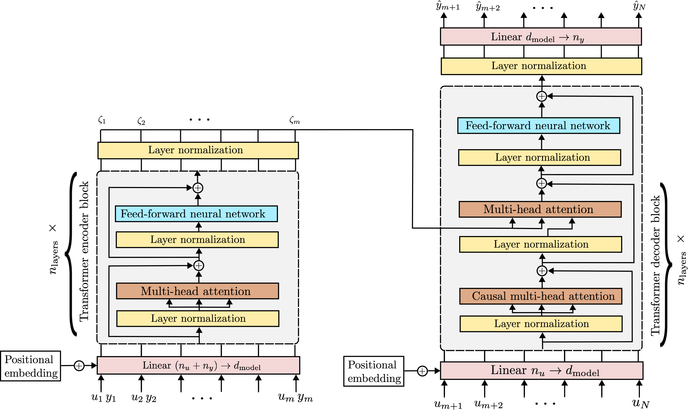

# In-context learning for model-free system identification

This repository contains the Python code to reproduce the results of the paper *In-context learning for model-free system identification* (in preparation, 2023)
by Marco Forgione, Filippo Pura and Dario Piga.


We introduce the concept of model-free in-context learning for System Identification, where a *generalized* model is able to describe an entire class of dynamical systems,
instead of a single instance. The generalized model is able to understand the underlying dynamics from a context of provided input/output samples and to 
perform a task such as one-step-ahead prediction or multi-step-ahead simulation, that would otherwise require a model trained on each particular datasets.


## One-step-ahead model-free prediction

Decoder-only (GPT-like) Transformer architecture for model-free one-step-ahead prediction: 

<!--  -->


## Multi-step-ahead model-free simulation

Encoder-decoder (machine-translation-like) Transformer architecture for model-free multi-step-ahead simulation:

<!--  -->


# Training scripts

The main training scripts are:

* ``train_onestep_lin.py``: Decoder-only transformer for one-step-ahead prediction on the LTI system class 
* ``train_onestep_wh.py``: Decoder-only transformer for one-step-ahead prediction on the WH system class 
* ``train_sim_lin.py``: Encoder-decoder-only transformer for multi-step-ahead simulation on the LTI system class 
* ``train_sim_wh.py``: Encoder-decoder-only transformer for multi-step-ahead simulation on the LTI system class 

All scripts except ``train_onestep_lin.py`` accept command-line arguments to customize the transformer architecture and aspects of the training. 
For instance, the large one-step-ahead transformer described in the paper may be trained with the command:

```
python train_onestep_wh.py --out-file ckpt_onestep_wh_large --seq-len 1024  --n-layer 12 --n-head 12 --n-embd 768 --batch-size 20 --cuda-device cuda:1
```

# Software requirements:
Experiments were performed on a Python 3.11 conda environment with

 * numpy
 * scipy
 * matplotlib
 * pytorch (>= 2.0.1)
 
These dependencies may be installed through the commands:

```
conda install numpy scipy pandas matplotlib
conda install pytorch -c pytorch
```

# Hardware requirements:
While the scripts can be run on a CPU, training is notably slow in this setup. For faster and more efficient training, a GPU is highly recommended.
To execute the paper's examples, we utilized a dedicated server equipped with an nVidia RTX 3090 GPU.

<!--

# Citing

If you find this project useful, we encourage you to:

* Star this repository :star: 


* Cite the [paper](https://arxiv.org/abs/2206.12928) 
```
@article{forgione2023a,
  title={Model-free in-context learning of dynamical systems with Transformers},
  author={Forgione, M. and Pura, F. and Piga, D.},
  journal={arXiv preprint arXiv:2206.12928},
  year={2022}
} 
```
-->
